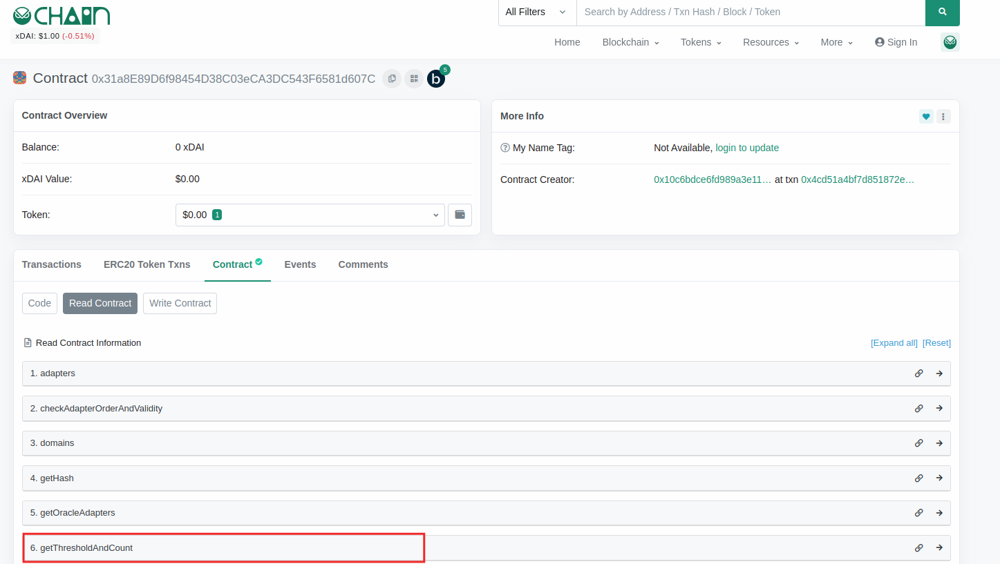
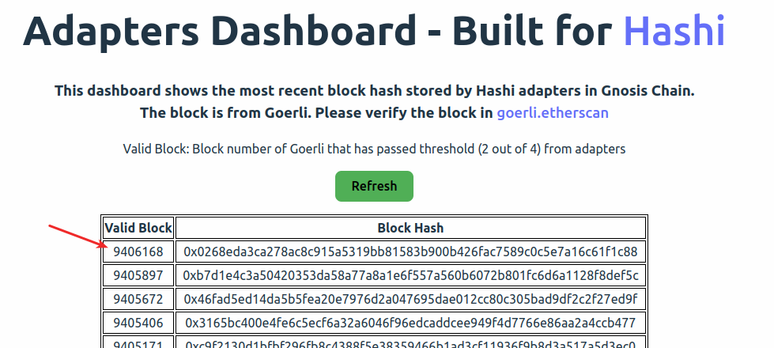

# Tutorial

## Query block hash from Hashi

To query a block hash from Hashi, navigate to [ShoyuBashi](https://gnosisscan.io/address/0x31a8e89d6f98454d38c03eca3dc543f6581d607c#readContract) contract on gnosisscan.  
Click `getThresholdHash` function.



Enter the domain (chain ID, i.e. 5 for Goerli) and id (block number from domain) for the block you want to query.  
The result will be the block hash that has passed the threshold from adapters (i.e. 2 out of 4 in Goerli <-> GC). Not every block will be stored by the adapters and reach threshold, if no threshold has been reached, the result will be bytes32(0). You can utilize [Adapters Dashboard](https://hashiadapters-dashboard-tvw47.ondigitalocean.app/) to check which block has been stored.


You may double check if the block hash is correct by searching your block hash in [Adapters Dashboard](https://hashiadapters-dashboard-tvw47.ondigitalocean.app/).



## Report block header

You may call a block header reporter to report and store the block hash, if the block you are looking for is not yet stored by the adapter.

1. Navigate to [AMB Header Reporter](https://goerli.etherscan.io/address/0xedc0b1d3de4496e0d917af42f29cb71eb2982319) or [Sygma Header Reporter](https://docs.gnosischain.com/bridges/hashi/) contract.
2. Select **Contract** and **Write Contract**.
3. Connect your wallet and switch to the correct network.
4. Click **reportHeaders** and input blockNumbers (uint256 []), [adapters address](https://docs.gnosischain.com/bridges/hashi/#current-deployments) and gas.

## Yaru and Yaho

With Yaru and Yaho, you can pass arbitrary message across the chain.

### Prerequisite

1. Deploy [Yaho](https://github.com/gnosis/hashi/blob/main/packages/evm/contracts/Yaho.sol) on Goerli, and [Yaru](https://github.com/gnosis/hashi/blob/main/packages/evm/contracts/Yaru.sol) on Gnosis Chain.
2. Deploy [Hashi Module](https://github.com/gnosis/hashi/blob/main/packages/evm/contracts/zodiac/HashiModule.sol) for Safe that will be called by Yaru, i.e. Safe on Gnosis Chain.
3. Deploy [AMB Message Relayer](https://github.com/gnosis/hashi/blob/main/packages/evm/contracts/adapters/AMB/AMBMessageRelayer.sol) on Goerli.

### Initiate Transaction

1. Create function calldata for the contract you want to call on Gnosis Chain.

```
const calldata = contractInterface.encodeFunctionData(function_name, parameters)
```

2. Create transaction calldata for Hashi Module.

```
const txData = hashi_module_interface.encodeFunctionData("executeTransaction", [
      ${contract_to_call_on_Gnosis_Chain},
      0,
      calldata,
      0,
]);
```

3. Create message with format below:

```
const message =
{
    to: ${Hashi Module address},
    toChainId: 100 // Gnosis Chain,
    data: ${tx_data}
}
```

4. call `Yaho.dispatchMessagesToAdapters([message],[AMB_Message_Relayer_Address],[AMB_Adapter_Address])`

5. Once the transaction is created, you need to collect `messsage Id` from [`MessageDispatched` event](https://github.com/gnosis/hashi/blob/main/packages/evm/contracts/Yaho.sol#L27) emitted from Yaho

### Claim Transaction

1. Call `Yaru.executeMessages([message],[messageId],[Safe_from_Goerli],[AMB_Adapter_Address])`
