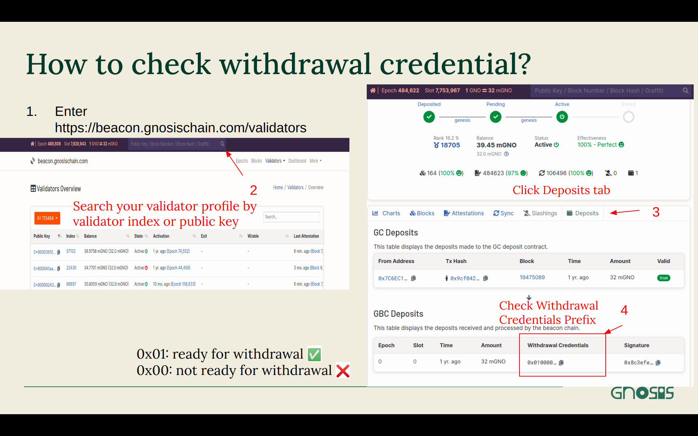

:::caution About Shanghai/Capella Upgrade
Validator withdrawals will be available after Shanghai/Capella Upgrade. The Core Dev team is currently working on testing. The exact date for Hardfork is TBD. Check out the latest update [here](../../../updates).
:::

# What is Validator Withdrawal?

Validator withdrawal allows a validator's account balance get withdrawn from Beacon Chain to Execution Layer, in the form of GNO. The GNO will be accrued on validator's withdrawal address on the Execution Layer, which is set using `eth1_withdrawal_address` option during validator key generation.    

There are 2 types of withdrawals: Partial Withdrawal and Full Withdrawal.    
**Partial Withdrawal**: Any balance in excess of 32mGNO from the account balance get withdrawn back to withdrawal address, automatically.     
**Full Withdrawal**: All the balance from validator's account get withdrawan back to withdrawal address. This has to be initiated by validator, signing [voluntary_exit](/node/management/voluntary-exit) message and broadcasting it to the network. It is irreversible.    

## What is the different between validator withdrawal in Gnosis Chain and Ethereum?

**For users: it is the same!**

**Technically:** 
Withdrawals are handled by a smart contract on Gnosis Chain
* specifically implemented for Gnosis in execution layer clients
* same contract as the deposit one
* pays out in GNO
* If there's no GNO left in the contract, withdrawals are retried whenever it's topped up
    * The failed withdrawal queue is cleared at a constat rate per slot (4-16/slot, TBD), in addition to new withdrawals.

**Reference**
1. [Gnosis Chain Withdrawals spec](https://github.com/gnosischain/specs/blob/master/execution/withdrawals.md)
2. [Withdrawal Contract](https://github.com/gnosischain/deposit-contract/pull/25)

## What action should a validator take?
### Check Withdrawal Credential
For any type of withdrawals, a validator need to have 0x01 withdrawal credential. You’re fine if you used `--eth1_withdrawal_address` to create your validator keys. If not, tooling will be made available.

There are 2 ways to check withdrawal credential of a validator:
1. Search on [https://beacon.gnosischain.com/](https://beacon.gnosischain.com/)
2. Search on deposit_m_*.json file of your validator.

### How to change the withdrawal credential?
Tools are being developed for Gnosis Chain. 
The general steps to change withdrawal credential will be:
1. Generate BLStoExecution file using tools like [ethdo](https://notes.ethereum.org/@launchpad/withdrawals-guide#BLS-to-execution-with-ethdo) or manually.
2. Post to file to BLStoExecution pool. 

**Reference**
1. [BLS to execution with ethdo](https://notes.ethereum.org/@launchpad/withdrawals-guide#BLS-to-execution-with-ethdo)
2. [BLS To Execution Change from Ethereum](https://launchpad.ethereum.org/en/btec/#broadcast-message)
3. [Teku's postBlsToExecutionChange API ](https://consensys.github.io/teku/#tag/Beacon/operation/postBlsToExecutionChange)

### Upgrade your clients
Upgrade your execution and consensus clients accordingly. The latest version of clients for the upgrade will be announced soon.

## Reference
1. [Gnosis Validator Meetup #5: Shanghai/Capella Upgrade](https://www.youtube.com/watch?v=6G7CmTHTor0)