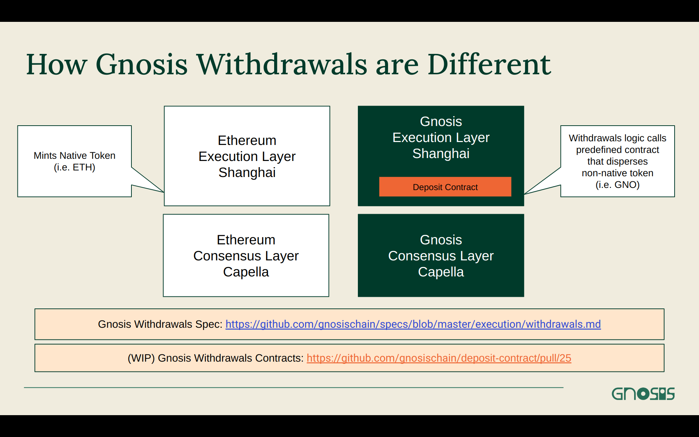
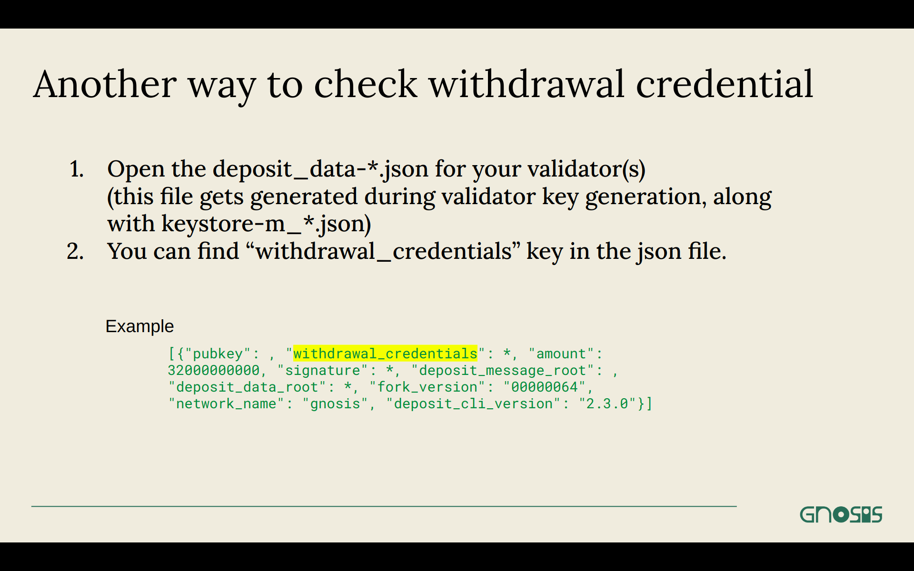
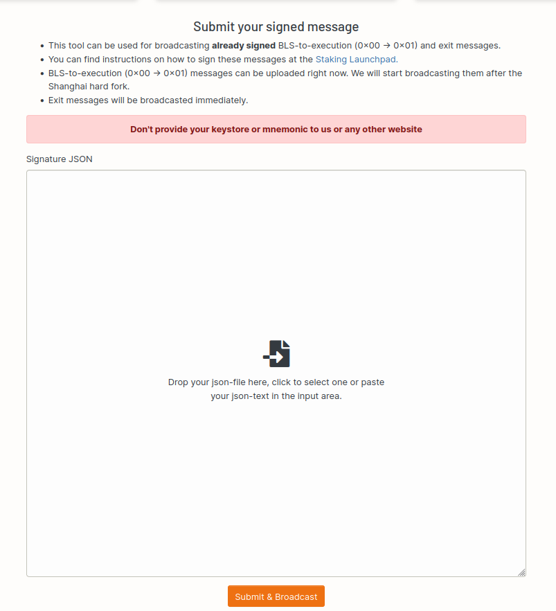
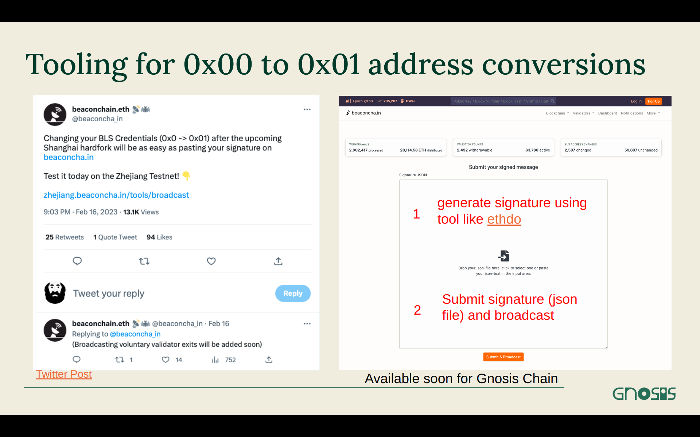

:::info Update your node for Shanghai/Capella hard-fork
Epoch: 648704  
Slot: 10379264  
Time: August 1, 2023 at 11:34.20 UTC!
:::

# Update your client

All client updates are ready for the upcoming Shapella hard-fork, please schedule time between now and July 30th to update your nodes!

Execution Layer:

✅ NethermindEth [v1.19.3](https://github.com/NethermindEth/nethermind/releases/tag/1.19.3)  
✅ ErigonEth [v2.48.0](https://github.com/ledgerwatch/erigon/releases/tag/v2.48.0)

Consensus Layer:

✅ Lighthouse [v4.3.0](https://github.com/sigp/lighthouse/releases/tag/v4.3.0)  
✅ Teku [v23.6.1](https://github.com/Consensys/teku/releases/tag/23.6.1)  
✅ Nimbus v23.6.0 (only with the following Docker image: http://ghcr.io/gnosischain/gnosis-nimbus-eth2:v23.6.0)  
✅ Lodestar [v1.9.1](https://github.com/ChainSafe/lodestar/releases/tag/v1.9.1)

DAppNode Packages

✅ Teku Gnosis v0.1.9  
✅ Lighthouse Gnosis v0.1.10  
✅ Lodestar Gnosis v0.1.2  
✅ Nethermind xDAI v1.0.34  
⌛️ Erigon and Nimbus - Forthcoming

# What is Validator Withdrawal?

Validator withdrawal allows a validator's account balance get withdrawn from Beacon Chain to Execution Layer, in the form of GNO. The GNO will be accrued on validator's withdrawal address on the Execution Layer, which is set using `eth1_withdrawal_address` option during validator key generation.

There are 2 types of withdrawals: Partial Withdrawal and Full Withdrawal.  
**Partial Withdrawal**: Any balance in excess of 32mGNO from the account balance get withdrawn back to withdrawal address, automatically.  
**Full Withdrawal**: All the balance from validator's account get withdrawn back to withdrawal address. This has to be initiated by validator, signing [voluntary_exit](./voluntary-exit.md) message and broadcasting it to the network. It is irreversible.

# Action needs to be taken by validators

## What is the difference between validator withdrawal in Gnosis Chain and Ethereum?



**For users: it is the same!**

**Technically:**
Withdrawals are handled by a smart contract on Gnosis Chain

- specifically implemented for Gnosis in execution layer clients
- same contract as the deposit one
- pays out in GNO
- If there's no GNO left in the contract, withdrawals are retried whenever it's topped up
  - The failed withdrawal queue is cleared at a constant rate per slot (4-16/slot, TBD), in addition to new withdrawals.

**Reference**

1. [Gnosis Chain Withdrawals spec](https://github.com/gnosischain/specs/blob/master/execution/withdrawals.md)
2. [Withdrawal Contract](https://github.com/gnosischain/deposit-contract/blob/master/contracts/SBCDepositContract.sol)

## What action should a validator take?

### Check Withdrawal Credential

For any type of withdrawals, a validator need to have `0x01` withdrawal credential. You’re fine if you used `--eth1_withdrawal_address` to create your validator keys. If not, tooling will be made available.

There are 2 ways to check withdrawal credential of a validator:

1. Search on [https://gnosischa.in/](https://gnosischa.in/)
2. Search on deposit*m*\*.json file of your validator.




### How to change the withdrawal credential?

Tools are being developed for Gnosis Chain.
The general steps to change withdrawal credential will be:

1. Generate BLStoExecution file using tools like [ethdo](https://notes.ethereum.org/@launchpad/withdrawals-guide#BLS-to-execution-with-ethdo) or manually.

2. Post the file to the BLStoExecution pool.

```mdx-code-block
<details>
<summary>Step-by-Step tutorial</summary>
<div>
```

**Online and Offline process**

The online and offline process contains three steps.

1. Generate data on the online computer.
2. Generate change-credential.json on an offline computer.
3. Broadcast the credential change operations to the Gnosis Network.

**Prerequisite**

1. On your online computer, open a terminal and download [ethdo v1.31.0](https://github.com/wealdtech/ethdo/releases) from Github/

```
wget https://github.com/wealdtech/ethdo/releases/download/v1.31.0/ethdo-1.31.0-linux-amd64.tar.gz
```

2. Extract ethdo

```
tar -xvf ethdo-1.31.0-linux-amd64.tar.gz
```

3. Check that ethdo is installed correctly by running

```
./ethdo --help
```

**Step 1: Obtain `offline-preparation.json` file**

1. Connect to your consensus node, and generate `offline-preparation.json`

```
./ethdo --connection=http://localhost:<Beacon_Node_Port> validator credentials set --prepare-offline
```

Check the port of your consensus node, i.e. Lighthouse's default http port is 5052.  
An `offline-preparation.json` file will be created.

2. Copy the `offline-preparation.json` file and ethdo software into a USB.

**Step 2: Generate `change-operations.json` file offline**

1. Use the file you've copied into the USB and run the following command on an offline computer.

   Make sure your `offline-preparation.json` is at the same directory where ethdo software is running.

```
./ethdo validator credentials set --offline --mnemonic="abandon abandon abandon … art" --withdrawal-address=0x0123…cdef
```

Replace `mnemonic` with the validator's mnemonic and `withdrawal-address` with a gnosis address for your validator's withdrawal reward.
A `change-operations.json` file will be created.

2. Copy the `change-operations.json` file from offline computer to an online computer.

**Step 3: Broadcast `change-operations.json` to the network**  
There are two ways to broadcast the operations:  
i. Using UI  
ii. Using curl to broadcast the data to your beacon node(advanced)

**Using UI:**

Upload `change-operations.json` to https://gnosischa.in/tools/broadcast, and click 'Submit & Broadcast'.  


**Using curl**  
This option is only recommended for advanced user. Please use it at your own risk.

1. Open a terminal, navigate to the same directory as you store your `change-operations.json`.
   Make sure to change the beacon_node_port according to your consensus client.  
   Run the following command.

```
curl -d @change-operations.json -H "Content-Type: application/json"  -X POST 127.0.0.1:<beacon_node_port>/eth/v1/beacon/pool/bls_to_execution_change
```

```mdx-code-block
</div>
</details>
```



**Reference**

1. [Changing withdrawal credential by ethdo](https://github.com/wealdtech/ethdo/blob/master/docs/changingwithdrawalcredentials.md)
2. [BLS to execution with ethdo](https://notes.ethereum.org/@launchpad/withdrawals-guide#BLS-to-execution-with-ethdo)
3. [BLS To Execution Change from Ethereum](https://launchpad.ethereum.org/en/btec/#broadcast-message)
4. [Teku's postBlsToExecutionChange API ](https://consensys.github.io/teku/#tag/Beacon/operation/postBlsToExecutionChange)

### Update your clients

Please refer to #Update your client section above.

## Reference

1. [Gnosis Validator Meetup #5: Shanghai/Capella Upgrade](https://www.youtube.com/watch?v=6G7CmTHTor0)
